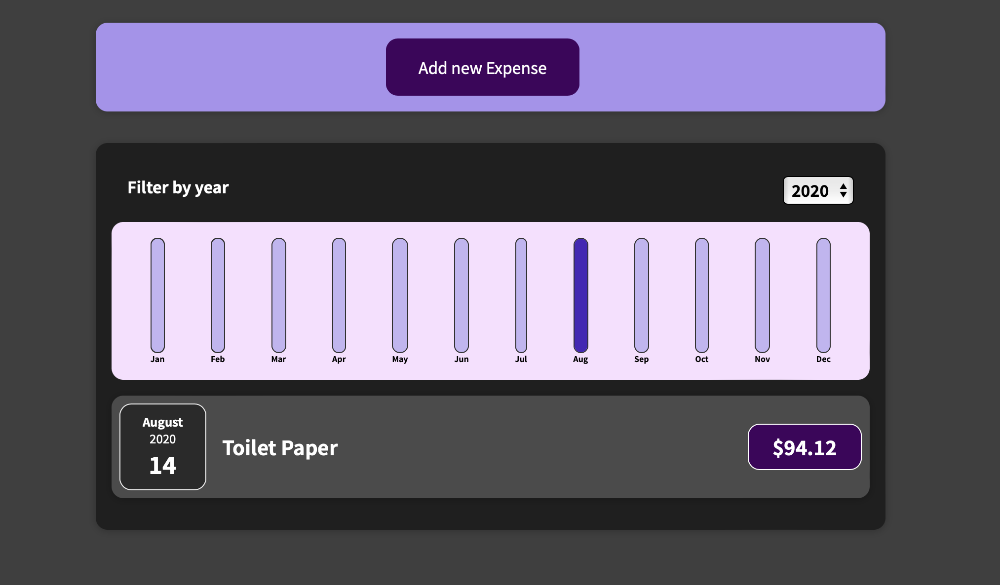

# Expense App

Expense App is a simple web application that allows users to manage and track their expenses. It provides features for adding, editing, and categorizing expenses, helping users keep their financial records organized.

## Table of Contents

- [Features](#features)
- [Demo](#demo)
- [Getting Started](#getting-started)
  - [Prerequisites](#prerequisites)
  - [Installation](#installation)
- [Usage](#usage)
- [Contributing](#contributing)

## Features

- Add new expenses with details such as title, date, and amount.
- Edit and update existing expenses.
- Categorize expenses for better organization.
- Filter expenses by category.
- View expense statistics and summaries.
- Responsive design for various screen sizes.

## Demo

You can try the Expense App online. [Demo Link](#)



## Getting Started

Follow these instructions to get a copy of the project up and running on your local machine for development and testing purposes.

### Prerequisites

- Node.js and npm installed on your machine.

### Installation

1. Clone the repository:

   ```bash
   git clone https://github.com/gurgenidzegiorgi/Expense-App.git
   ```

## Usage

1. Change to the project directory:

   ```bash
   cd Expense-App

   ```

2. Install the project dependencies:

   ```bash
   npm install

   ```

3. Start the development server:

   ```bash
   npm start
   ```

## Contributing

Contributions are welcome! If you'd like to contribute to the project, please follow these steps:

1. Fork the repository on GitHub.
2. Create a new branch for your feature or bug fix.
3. Make your changes and commit them with descriptive commit messages.
4. Push your changes to your forked repository.
5. Submit a pull request to the main repository explaining your changes.
